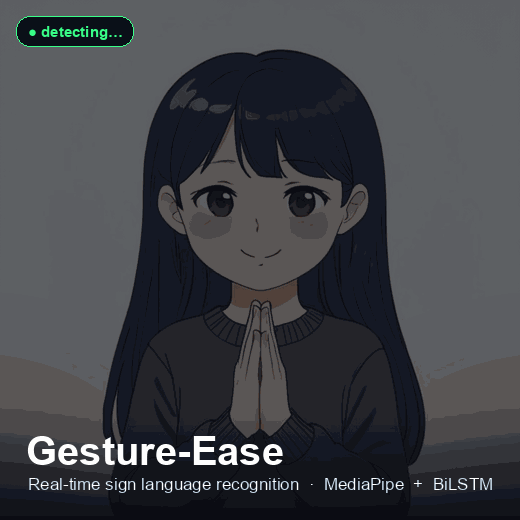

# Gesture-Ease

A real-time sign language learning platform that uses computer vision and deep learning to recognize hand gestures. Users practice sign language through their webcam and receive instant feedback, points, and progress tracking.

**🔗 Live demo: [80.225.204.112.nip.io](https://80.225.204.112.nip.io)** — practice signs in your browser with real-time AI feedback (best on Chrome; allow camera access).

## Demo



Practice mode — perform a sign in front of your camera, and the model tells you if you got it right.

## How It Works

1. The webcam feed is processed frame-by-frame in the browser
2. MediaPipe extracts 21-point hand landmarks per frame (126 features across 2 hands)
3. A sequence of 30 frames is sent to the Flask backend
4. A BiLSTM model predicts whether the gesture matches the target sign
5. The result (confidence score, points, feedback) is returned and shown instantly

## Tech Stack

| Layer | Technology |
|-------|-----------|
| Frontend | React 19, Canvas API, MediaPipe (browser) |
| Backend | Python, Flask, TensorFlow/Keras |
| ML Model | BiLSTM neural network (82.6% top-1 accuracy, 92.5% top-3) |
| Database | MySQL with SQLAlchemy ORM |
| Auth | JWT tokens, hashed passwords |
| Deployment | Docker, Gunicorn |

## Project Structure

```
Gesture-Ease/
├── backend/
│   ├── app.py              # Flask REST API
│   ├── database.py         # SQLAlchemy models (User, Progress, Attempts)
│   ├── auth.py             # JWT authentication
│   ├── train_model.py      # BiLSTM training pipeline
│   ├── collect_gesture.py  # Data collection CLI
│   └── requirements.txt
├── frontend/
│   └── src/
│       ├── App.js          # Main React application
│       └── SignPractice.js # Practice UI component
├── docker-compose.yml
└── Dockerfile
```

## Local Setup

### Prerequisites

- Python 3.9+
- Node.js 18+
- MySQL 8+
- A webcam

### Backend

```bash
pip install -r requirements.txt
python app.py
```

### Frontend

```bash
cd frontend
npm install
npm start
```

### Docker (recommended)

```bash
# Edit backend/.env with your database credentials

docker-compose up --build
```

The app will be available at `http://localhost:3000`, backend at `http://localhost:5000`.

## Environment Variables

Copy `backend/.env.example` to `backend/.env` and set:

| Variable | Description |
|----------|-------------|
| `DATABASE_URL` | MySQL connection string |
| `SECRET_KEY` | Flask secret key |
| `JWT_SECRET` | JWT signing key |
| `FLASK_ENV` | `development` or `production` |

## API Endpoints

| Endpoint | Method | Description |
|----------|--------|-------------|
| `/api/predict_landmarks` | POST | Verify a gesture against a target word |
| `/api/search` | GET/POST | Search available sign language words |
| `/api/words` | GET | List all supported signs |
| `/api/auth/register` | POST | Create account |
| `/api/auth/login` | POST | Login |
| `/api/attempt` | POST | Save a practice attempt |
| `/api/user/<id>/progress` | GET | Get user progress |
| `/api/leaderboard` | GET | Top users |
| `/health` | GET | Health check |

## ML Model

- **Architecture:** Bidirectional LSTM (BiLSTM)
- **Input:** 30-frame sequences × 126 landmark features (2 hands × 21 points × 3 coords)
- **Training data:** Custom collected ASL gesture videos
- **Accuracy:** 82.6% top-1, 92.5% top-3

To train or retrain the model:

```bash
cd backend
python collect_gesture.py   # collect new gesture data
python train_model.py       # train BiLSTM model
```

## Deployment

The app runs as a single Docker image where Flask serves the built React frontend, the API, and the model together. A live instance is hosted on a small Ubuntu VM behind Caddy (automatic HTTPS). See `Dockerfile` and `deploy/oracle-setup.sh`.
